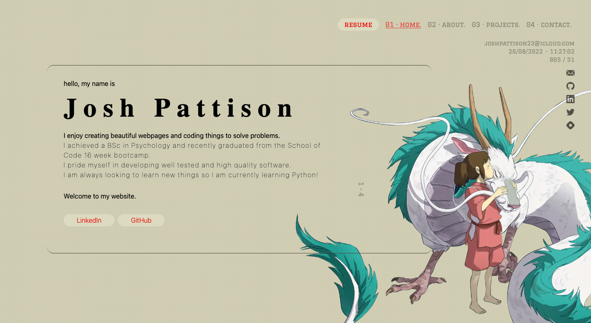

<h1 align="center"> joshpattison.com - portfolio </h1>

  My personal portfolio <a href="https://joshpattison.com" target="_blank">joshpattison.com</a> built with <a href="https://nextjs.org/" target="_blank">Next.js</a>, <a href="https://tailwindcss.com/" target="_blank">Tailwind CSS</a>, CSS 3 and deployed on <a href="https://vercel.com/" target="_blank"> Vercel</a>.

# Tech stack explanation

For my personal portfolio I wanted to take the time to try new things. I felt it was the perfect opportunity to improve myself as a software developer in my own time away from the School of Code. For this reason I chose a brand new framework, a new deployment tool and a CSS library.
 
 
I chose next.js for a couple of main reasons, the first and most obvious was the fact it was new to me and therefore I could take more away from it. Second of all it used a different structure to create react app. It's use of pages and lack of a html document offered me a new experience and the best opportunity for me to cross compare my preferences between the two. The final main reason for picking next.js comes from my deployment decision.
 
 
I chose Vercel for two main reasons. Much simpler than choosing a framework I chose Vercel because it was something I had never used and it works perfectly with next.js, which inturn swayed me toward next.js itself.
 
 
I didn't want to stop with just a new framework and a new method of deployment. So I chose to use a CSS library. We had used UI libraries for react at the bootcamp before and I could see possible pros and cons. One con specifically was the rigidity of them. So, my thought was that a CSS library might offer some more flexibility whilst bringing some of the pros of UI/component library. I chose Tailwind as I had researched it before and it paired well with next.js.
 

## Testing

I wanted to follow best practice with this portfolio. I wanted to ensure it was tested like any good bit of code should be.
I chose cypress testing for this project as I felt it most appropriate to test a successful user experience. My portfolio serves as a connection between me and the public eye and I wanted to make sure that experience was well tested, secure, and wasn't broken at any point!

# Inspiration/Design explanation

I wanted to create a portfolio using various styles and inspirations to best show off my personality. I am going to be explaining my inspirations and my reasoning below.

Table of contents

- [Components](#components)  
- [Homepage](#homepage)  
- [About Page and Projects Page](#about-page-and-projects-page)  
- [Contact Page](#contact-page)  

## Components

My components (_the navbar, logo-bar, page number and the date/time/cursor tracker_) come from the same sources of inspiration.
 
 
The look of these components comes from one of my favourite clothes designers; [Virgil Abloh](https://www.off---white.com/en-gb/) (specifically OFF-WHITE for this portfolio).
 

#### Component Takeaway -

I used Tailwind CSS to style the components of this portfolio. It was very easy to use and I thought the documentation was great. However, as my code base begins to increase and I look to move on to my individual pages I feel I will need to make some changes. I don't like the _look_ of my code with Tailwind, it feels really bloated within the HTML. I intend to keep the Tailwind as a reminder of my learning experience.

## Homepage

The inspiration for my home pages comes from various software developer portfolios. This is mainly the structure of the page and also the way the text is displayed on the homepage, one example would be [Brittany Chiang's Portfolio](https://brittanychiang.com/).

I wanted to bring my love for anime/manga to my portfolio but wanted to do it in a stylized and clean way. I felt that the art from [Studio Ghibli](http://ghiblicollection.com/) was a perfect fit. I used the beautiful imagery from Spirited Away to make a home page I am happy with!

This current itteration of my homepage was actually the last thing I built for this portfolio. This means much of the inspiration comes from my other pages as I tried to keep a somewhat consistent style. My original homepage was completley different and can be viewed on the [home-page-V1 branch](https://github.com/pattisoj/portfolio/tree/home-page-V1) of this repository.

#### Homepage takeaway

For me the homepage was all about development over a project. When I looked at my original homepage after completing the rest of my portfolio it was clear to me it needed to change. I was happy with the look of my homepage standalone but it really didn't fit with the look of the whole site so left me feeling incomplete. This page really highlighted the importance of being able to let go of code you'd written before to improve the overall page.

## About Page and Projects Page

The about page and projects page were created and styled after the menu screens in Nier: Automata (ニーア オートマタ). Nier: Automata is an action role-playing video game developed by PlatinumGames and published by Square Enix for PlayStation 4 and Microsoft Windows. The game is set in the midst of a proxy war between machines created by otherworldly invaders and the remnants of humanity, the story follows the battles of a combat android and her companion. You can read more about NeiR: Automata on the [Wikipedia](https://en.wikipedia.org/wiki/Nier:_Automata) page.
 
 
I chose to use the styles of Neir: Automata because I recently played the game and really enjoyed it. But beyond that I absolutely loved the aesthetic of this game and found the menus conveyed a lot of information in such a clean and artistic way, that I just had to implement it myself.
 
The about page and projects page of any website, and in my portfolio, have to convey a lot of information and I wanted it to be styled in a clean way and for that reason the Neir: Automata styling was a clear winner!
 
 
I have to give a huge thank you to [Ethan Chan (aka metakirby5)](https://github.com/metakirby5) for creating the [YoRHa github repository](https://github.com/metakirby5/yorha) which contains Neir: Automata css styling. Much of which I used for these pages.

#### About Page and Projects Page Takeaway -

After returning to 'normal' CSS and not using Tailwind I have a further appreciation for Tailwind's quick implementation but also the control and how much cleaner the HTML looks using plain old CSS! I also didn't enjoy my initial experience with next/image but it is something I have gotten used to after using it multiple times in these pages. I was able to use this experience when building my contact page.

## Contact Page

My aim with the contact page was to make it simplistic. I wanted the user to see the links to give them to other places and not have their attention drawn away from it too much.

As I mentioned earlier I really enjoy anime as a whole and felt that the art from [Studio Ghibli](http://ghiblicollection.com/) was a perfect fit for this simple style. With this page being so simple I wanted to add some nice animations that were clean and subtle. This was my favourite part of this page; tinkering with subtle details!

#### Contact Page Takeaway -

Simple is a fun challenge. When deciding to do a 'simple' page it can seem as if it will be quick and easy. However, I found great pleasure in taking my time with this page a focusing in on small details and using the subtleties to make the page seem complete and not empty! I hope this is felt from a user's perspective.
